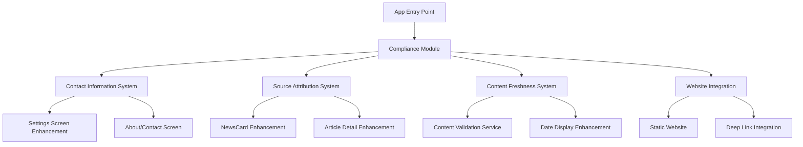

# Design Document

## Overview

This design addresses Google Play Store's News policy compliance requirements for our education news aggregator app. The solution implements a comprehensive compliance system that includes contact information display, source attribution enhancement, news aggregator identification, website creation, and content freshness validation. The design integrates seamlessly with the existing React Native Expo architecture while maintaining the app's core functionality and user experience.

## Architecture

### High-Level Architecture



### Component Integration

The compliance system integrates with existing components:
- **SettingsScreen**: Enhanced with contact information and about section
- **NewsCard**: Enhanced with prominent source attribution
- **Article Components**: Enhanced source display and transparency
- **New Components**: ContactScreen, AboutScreen, ComplianceService

## Components and Interfaces

### 1. Contact Information System

#### ContactScreen Component
```typescript
interface ContactScreenProps {
  navigation: NavigationProp;
}

interface ContactInfo {
  email: string;
  phone?: string;
  website: string;
  address?: string;
  supportHours?: string;
}
```

#### AboutScreen Component
```typescript
interface AboutScreenProps {
  navigation: NavigationProp;
}

interface AppInfo {
  version: string;
  description: string;
  purpose: string;
  aggregatorDisclaimer: string;
  privacyPolicyUrl: string;
  termsOfServiceUrl: string;
}
```

### 2. Source Attribution System

#### Enhanced NewsCard
```typescript
interface SourceAttributionProps {
  article: Article;
  showFullAttribution?: boolean;
  onSourcePress?: () => void;
}

interface SourceInfo {
  sourceName: string;
  sourceUrl?: string;
  sourceIcon?: string;
  publishDate: string;
  author?: string;
}
```

#### SourceAttributionComponent
```typescript
interface SourceAttributionComponentProps {
  source: SourceInfo;
  variant: 'compact' | 'full' | 'detailed';
  showIcon?: boolean;
  onPress?: () => void;
}
```

### 3. Content Freshness System

#### ContentValidationService
```typescript
interface ContentValidationService {
  validateContentFreshness(articles: Article[]): Promise<ValidationResult>;
  getOldContent(cutoffDate: Date): Promise<Article[]>;
  markContentForUpdate(articleIds: string[]): Promise<void>;
  generateFreshnessReport(): Promise<FreshnessReport>;
}

interface ValidationResult {
  totalArticles: number;
  freshArticles: number;
  staleArticles: number;
  oldestArticleDate: Date;
  complianceStatus: 'compliant' | 'warning' | 'non-compliant';
}

interface FreshnessReport {
  generatedAt: Date;
  summary: ValidationResult;
  staleArticles: Article[];
  recommendations: string[];
}
```

### 4. Compliance Configuration

#### ComplianceConfig
```typescript
interface ComplianceConfig {
  contactInfo: ContactInfo;
  appInfo: AppInfo;
  contentPolicy: {
    maxContentAge: number; // days
    warningThreshold: number; // days
    minimumFreshContent: number; // percentage
  };
  sourceAttribution: {
    showSourceName: boolean;
    showSourceIcon: boolean;
    showPublishDate: boolean;
    showAuthor: boolean;
    requireSourceUrl: boolean;
  };
  aggregatorSettings: {
    showAggregatorDisclaimer: boolean;
    disclaimerText: string;
    transparencyLevel: 'basic' | 'detailed';
  };
}
```

## Data Models

### Enhanced Article Model
The existing Article interface from supabase.ts already includes the necessary fields:
- `source_name`: Publisher name
- `source_url`: Original article URL
- `source_icon`: Publisher icon
- `created_at`: Publication timestamp

### New Data Models

#### ComplianceStatus
```typescript
interface ComplianceStatus {
  id: string;
  lastChecked: Date;
  contactInfoCompliant: boolean;
  sourceAttributionCompliant: boolean;
  contentFreshnessCompliant: boolean;
  websiteCompliant: boolean;
  overallStatus: 'compliant' | 'warning' | 'non-compliant';
  issues: ComplianceIssue[];
  nextCheckDue: Date;
}

interface ComplianceIssue {
  type: 'contact' | 'source' | 'freshness' | 'website';
  severity: 'low' | 'medium' | 'high' | 'critical';
  description: string;
  resolution: string;
  dueDate?: Date;
}
```

## Error Handling

### Compliance Error Types
```typescript
enum ComplianceErrorType {
  MISSING_CONTACT_INFO = 'missing_contact_info',
  INVALID_SOURCE_ATTRIBUTION = 'invalid_source_attribution',
  STALE_CONTENT = 'stale_content',
  WEBSITE_UNAVAILABLE = 'website_unavailable',
  CONFIGURATION_ERROR = 'configuration_error'
}

interface ComplianceError extends Error {
  type: ComplianceErrorType;
  severity: 'warning' | 'error' | 'critical';
  resolution: string;
  affectedComponents: string[];
}
```

### Error Recovery Strategies
1. **Graceful Degradation**: Show basic compliance info if enhanced features fail
2. **Fallback Content**: Use default contact info if dynamic loading fails
3. **User Notification**: Inform users of compliance-related issues
4. **Automatic Retry**: Retry failed compliance checks with exponential backoff

## Testing Strategy

### Unit Testing
- **ContactScreen**: Render testing, navigation, contact info display
- **SourceAttribution**: Various source configurations, missing data handling
- **ContentValidation**: Date calculations, compliance status determination
- **ComplianceService**: Configuration loading, status checking

### Integration Testing
- **Settings Integration**: Contact info accessibility from settings
- **NewsCard Integration**: Source attribution display and interaction
- **Navigation Flow**: Complete user journey through compliance features
- **Data Flow**: Article data to source attribution rendering

### Compliance Testing
- **Google Play Requirements**: Verify each requirement is met
- **Accessibility**: Ensure compliance features are accessible
- **Performance**: Verify compliance features don't impact app performance
- **Cross-Platform**: Test compliance features on iOS and Android

### End-to-End Testing
```typescript
describe('Google Play Compliance', () => {
  test('Contact information is easily discoverable', async () => {
    // Navigate to settings
    // Find contact information within 2 taps
    // Verify email/phone is displayed
  });

  test('Source attribution is visible on all articles', async () => {
    // Load news feed
    // Verify each article shows source name
    // Test source link functionality
  });

  test('Content freshness meets requirements', async () => {
    // Check article dates
    // Verify no content older than 3 months
    // Test content update mechanism
  });
});
```

### Website Testing
- **Accessibility**: Contact page loads and displays information
- **Mobile Responsiveness**: Website works on mobile devices
- **SEO**: Proper meta tags and structured data
- **Performance**: Fast loading times
- **SSL**: Secure HTTPS connection

## Implementation Phases

### Phase 1: Contact Information System
- Create ContactScreen and AboutScreen components
- Enhance SettingsScreen with contact navigation
- Implement contact information configuration
- Add navigation routes

### Phase 2: Source Attribution Enhancement
- Enhance NewsCard with prominent source display
- Create SourceAttributionComponent
- Update article detail screens
- Implement source link handling

### Phase 3: Content Freshness System
- Implement ContentValidationService
- Add date validation logic
- Create freshness monitoring
- Implement content update notifications

### Phase 4: Website Creation
- Create static website with contact information
- Implement responsive design
- Add privacy policy and terms
- Configure hosting and domain

### Phase 5: Integration and Testing
- Integrate all compliance features
- Comprehensive testing
- Performance optimization
- Documentation updates

## Security Considerations

### Data Privacy
- Contact information stored securely
- User data protection in compliance features
- GDPR compliance for website

### Input Validation
- Validate contact form submissions
- Sanitize user-generated content
- Prevent XSS in web components

### API Security
- Secure compliance configuration endpoints
- Rate limiting for compliance checks
- Authentication for admin features

## Performance Considerations

### Optimization Strategies
- Lazy loading of compliance components
- Caching of compliance configuration
- Efficient source attribution rendering
- Minimal impact on app startup time

### Monitoring
- Track compliance feature usage
- Monitor performance impact
- Alert on compliance failures
- Regular compliance status checks