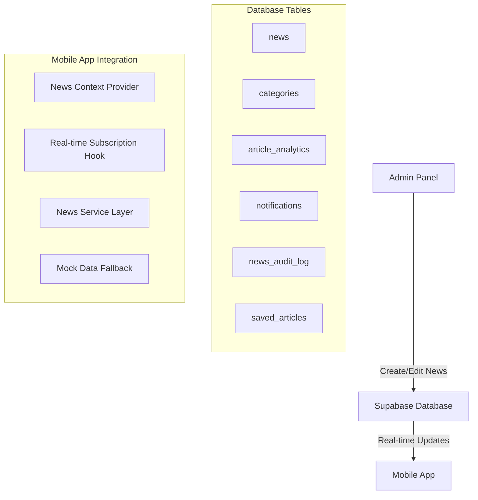
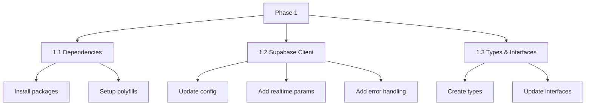
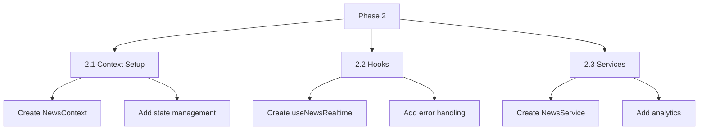
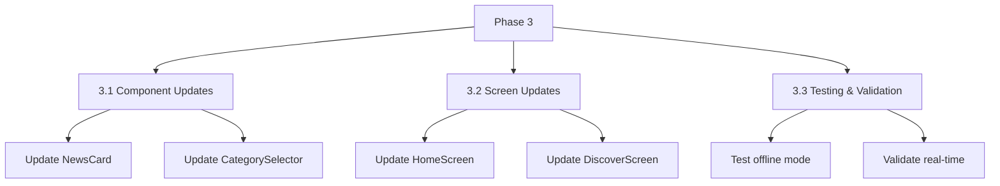
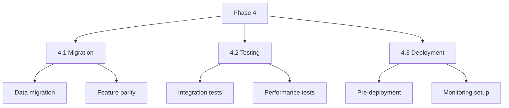
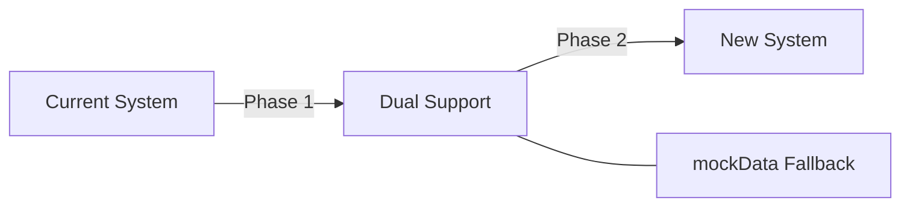

# News Article Migration Plan

This document outlines the detailed implementation plan for integrating the admin panel's Supabase backend with our mobile application's news system.

## Overview

## Phase 1: Supabase Client & Dependencies Setup ✅

### 1.1 Dependencies Setup (1-2 hours) ✅
1. Install required packages:
   - @supabase/supabase-js
   - react-native-url-polyfill
   - @react-native-async-storage/async-storage
2. Setup polyfills in index.ts
3. Configure AsyncStorage implementation

### 1.2 Supabase Client Configuration (2-3 hours) ✅
1. Update utils/supabase.ts:
   - Add realtime configuration
   - Set optimized timeout values
   - Configure reconnection logic
2. Implement error handlers:
   - Network error handling
   - Session management
   - Subscription error handling
3. Add connection status monitoring

### 1.3 Types & Interfaces Setup (2-3 hours) ✅
1. Create types/supabase.ts
2. Define database types from schema
3. Update Article interface
4. Add type guards and utilities

## Phase 2: Data Layer Implementation

### 2.1 Context Setup (2-3 hours) ✅
1. Create context/NewsContext.tsx:
   - Define context structure
   - Add state management
   - Implement loading states
   - Add error handling

### 2.2 Hooks Implementation (3-4 hours) ✅
1. Create hooks/useNewsRealtime.ts:
   - Initial data fetching
   - Real-time subscription setup
   - Error handling
   - Cleanup logic
2. Add pagination support
3. Implement category filtering

### 2.3 Services Layer (2-3 hours) ✅
1. Create services/newsService.ts:
   - CRUD operations ✅
   - Real-time handlers ✅
   - Error handling ✅
2. Add analytics tracking ✅
3. Implement caching strategy ✅

## Phase 3: UI Updates & Integration

### 3.1 Component Updates (2-3 hours) ✅
1. Update components/NewsCard.tsx:
   - Map new data structure
   - Add loading states
   - Implement error UI
2. Update components/CategorySelector.tsx:
   - Add dynamic categories
   - Optimize rendering

### 3.2 Screen Updates (3-4 hours) ✅
1. Update screens/HomeScreen.tsx:
   - Integrate NewsContext
   - Add pull-to-refresh
   - Implement infinite scroll
   - Add error boundaries
2. Update screens/DiscoverScreen.tsx:
   - Add category filtering
   - Implement search
3. Add loading indicators

### 3.3 Testing & Validation (2-3 hours) ⏳
1. Test offline functionality:
   - Verify mockData fallback
   - Test error recovery
2. Validate real-time updates:
   - Test subscription handling
   - Verify data consistency
3. Performance testing:
   - Memory usage
   - Render optimization

## Phase 4: Final Integration & Testing ⏳

### 4.1 Migration (2-3 hours)
1. Data migration tasks
2. Verify feature parity
3. Handle edge cases

### 4.2 Testing (2-3 hours)
1. Run integration tests
2. Conduct performance testing
3. User acceptance testing

### 4.3 Deployment (1-2 hours)
1. Pre-deployment checks
2. Setup monitoring
3. Deploy to production

## Migration Strategy

The total estimated time for implementation is 20-25 hours, with each phase building upon the previous one to ensure a smooth transition from the current system to the new Supabase-backed implementation.
