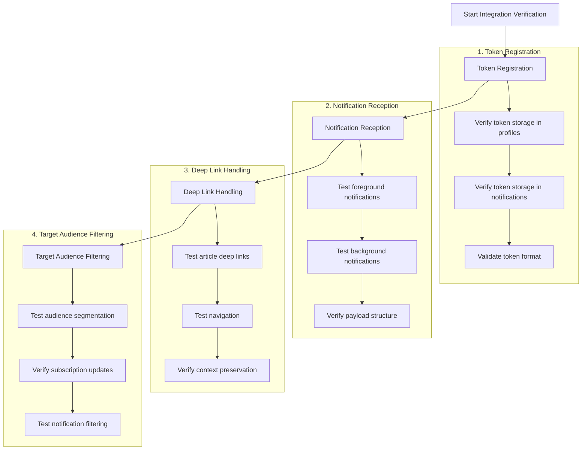

# Push Notification Integration Verification Plan

## Overview
This document outlines the plan for verifying the integration between the admin panel and React Native app for push notifications, using Supabase as the common backend.

## System Architecture



## Verification Steps

### 1. Token Registration Verification

#### Test Cases
1. New User Registration
   - Install app and complete registration
   - Verify token stored in profiles.notification_preferences
   - Validate token format matches Expo requirements
   
2. Token Refresh
   - Force token refresh in app
   - Verify token updated in both tables
   - Check old token invalidated

3. Data Structure Validation
   ```typescript
   // Expected structure in profiles
   {
     notification_preferences: {
       push: boolean,
       email: boolean,
       fcm_token: string,
       push_enabled: boolean,
       subscriptions: string[]
     }
   }
   ```

### 2. Notification Reception Testing

#### Test Cases
1. Foreground State
   - Send notification from admin panel
   - Verify toast notification appears
   - Validate payload matches sent data

2. Background State
   - Send notification with app in background
   - Verify system notification appears
   - Test notification tap behavior

3. Killed State
   - Send notification with app closed
   - Verify app launches correctly
   - Validate deep link processing

### 3. Deep Link Handling

#### Test Cases
1. Article Links
   - Send notification with article deep link
   - Verify navigation to correct article
   - Test back navigation behavior

2. Context Preservation
   - Test deep link with app in different states
   - Verify data loading and state management
   - Validate error handling

### 4. Target Audience System

#### Test Cases
1. Audience Segmentation
   - Test each target audience category:
     * all
     * education
     * visa
     * scholarship
     * course
     * immigration
   
2. Subscription Management
   - Update user subscriptions
   - Verify notification filtering
   - Test subscription sync

## Integration Points

### Admin Panel Endpoint
```typescript
const EXPO_API_URL = 'https://exp.host/--/api/v2/push/send';

interface NotificationPayload {
  title: string;
  body: string;
  deep_link?: string;
  data?: Record<string, unknown>;
}
```

### Database Schema
1. Profiles Table
   - notification_preferences JSON column
   - Last updated timestamp
   
2. Notifications Table
   - type: 'push'
   - target_audience field
   - expo_push_token field
   - sent_at timestamp

## Success Criteria
- [x] Token registration working
- [ ] Notifications received in all app states
- [ ] Deep links functioning correctly
- [ ] Target audience filtering accurate
- [ ] Error handling implemented
- [ ] Performance metrics acceptable

## Next Steps
1. Complete verification checklist
2. Document any issues found
3. Implement fixes if needed
4. Perform load testing
5. Monitor error rates